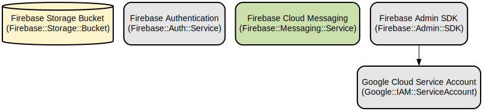

# Elearn Prepa: A Comprehensive Mobile Learning Platform for Exam Preparation

Elearn Prepa is a React Native mobile application that provides an interactive and personalized learning experience for students preparing for competitive exams. The platform offers a rich set of features including course content, quizzes, exercises, flashcards, and past exam papers, all accessible through an intuitive mobile interface.

The application leverages modern mobile development technologies to deliver a seamless learning experience with features like real-time progress tracking, personalized learning paths, interactive quizzes with instant feedback, and offline content access. Built with Expo and React Native, it provides a native experience across iOS and Android platforms while maintaining a single codebase.

## Repository Structure
```
.
├── app/                      # Main application screens and navigation
│   ├── (app)/               # Protected app routes requiring authentication
│   │   ├── (catalogue)/     # Shop and payment screens
│   │   ├── learn/          # Learning content and course screens
│   │   └── profile/        # User profile and settings
│   ├── (auth)/             # Authentication related screens
│   └── (callbacks)/        # Payment and external service callbacks
├── components/              # Reusable UI components
│   ├── shared/             # Shared components across screens
│   └── ui/                 # Basic UI elements and primitives
├── contexts/               # React contexts for state management
├── hooks/                  # Custom React hooks
├── lib/                    # Core libraries and service integrations
├── services/              # Business logic and API services
├── types/                 # TypeScript type definitions
└── utils/                 # Utility functions and helpers
```

## Usage Instructions
### Prerequisites
- Node.js 16.x or later
- Expo CLI (`npm install -g expo-cli`)
- iOS Simulator (for iOS development) or Android Studio (for Android development)
- Supabase account and project setup
- Firebase project setup for notifications
- NotchPay account for payment processing

### Installation

```bash
# Clone the repository
git clone <repository-url>
cd elearn-prepa

# Install dependencies
npm install

# Set up environment variables
cp .env.example .env
# Edit .env with your configuration

# Start the development server
npx expo start
```

### Quick Start
1. Authentication Setup:
```typescript
// Configure Supabase authentication in lib/supabase.ts
const supabaseUrl = process.env.SUPABASE_URL
const supabaseAnonKey = process.env.SUPABASE_ANON_KEY

const supabase = createClient(supabaseUrl, supabaseAnonKey, {
  auth: {
    storage: ExpoSecureStore,
    autoRefreshToken: true,
    persistSession: true,
    detectSessionInUrl: false,
  },
})
```

2. Basic Usage:
```typescript
// Import necessary hooks and components
import { useAuth } from '@/contexts/auth'
import { useUserInfo } from '@/contexts/useUserInfo'

// Use authentication in your components
function MyComponent() {
  const { user, signIn, signOut } = useAuth()
  const { lastCourse, toDayXp } = useUserInfo()
  
  // Component logic
}
```

### More Detailed Examples
1. Implementing a Quiz:
```typescript
import { useQuizContext } from '@/contexts/quizContext'

function QuizComponent() {
  const { 
    currentQuestion, 
    handleAnswerSelect,
    handleNextQuestion 
  } = useQuizContext()
  
  return (
    // Quiz UI implementation
  )
}
```

2. Course Progress Tracking:
```typescript
import { useCourseProgress } from '@/hooks/useCourseProgress'

function CourseProgress({ courseId }) {
  const { progress, markSectionAsComplete } = useCourseProgress(courseId)
  
  // Progress tracking implementation
}
```

### Troubleshooting
1. Authentication Issues
- Error: "Session not found"
  ```typescript
  // Check if session exists
  const { data: { session } } = await supabase.auth.getSession()
  if (!session) {
    // Redirect to login
  }
  ```
- Solution: Clear storage and re-authenticate

2. Payment Processing
- Error: "Payment initialization failed"
  - Check NotchPay API credentials
  - Verify payment amount format
  - Ensure proper error handling:
  ```typescript
  try {
    await initiatePayment(amount)
  } catch (error) {
    console.error('Payment error:', error)
    // Handle specific error cases
  }
  ```

## Data Flow
The application follows a unidirectional data flow pattern with React Context for state management and SWR for data fetching.

```ascii
┌──────────────┐     ┌──────────────┐     ┌──────────────┐
│   Supabase   │     │    React     │     │     UI       │
│   Database   │◄────┤   Contexts   │◄────┤  Components  │
└──────────────┘     └──────────────┘     └──────────────┘
       ▲                    ▲                    ▲
       │                    │                    │
       │                    │                    │
┌──────────────┐     ┌──────────────┐     ┌──────────────┐
│   Services   │     │    Hooks     │     │   Actions    │
│              │◄────┤              │◄────┤              │
└──────────────┘     └──────────────┘     └──────────────┘
```

Key interactions:
- Authentication state managed through AuthContext
- Real-time data updates via Supabase subscriptions
- Course progress tracked through CourseProgressService
- Quiz state managed through QuizContext
- File downloads handled by FileDownloadService
- Payments processed through NotchPay integration

## Infrastructure


### Firebase Configuration
- Project ID: elearn5
- Storage Bucket: elearn5.firebasestorage.app
- Client ID: 308270925920-android

### Google Cloud Service Account
- Project ID: elear-445209
- Client Email: elearn-prepa@elear-445209.iam.gserviceaccount.com
- Service Account Type: Firebase Admin SDK

### NotchPay Integration
- Payment processing service
- Handles mobile money and card payments
- Webhook integration for payment status updates

## Expo Updates Agent

Cette application implémente un agent de mise à jour automatique qui gère les mises à jour OTA (Over-The-Air) via Expo Updates.

### Fonctionnalités

- **Vérification automatique** : L'agent vérifie automatiquement les mises à jour au démarrage de l'application et toutes les 30 minutes
- **Téléchargement en arrière-plan** : Les mises à jour sont téléchargées automatiquement en arrière-plan sans interrompre l'utilisateur
- **Notification utilisateur** : Une modal élégante informe l'utilisateur lorsqu'une mise à jour est prête à être appliquée
- **Application immédiate** : L'utilisateur peut choisir d'appliquer la mise à jour immédiatement ou plus tard
- **Vérification au premier plan** : L'agent vérifie les mises à jour lorsque l'application revient au premier plan

### Architecture

#### Composants principaux

1. **UpdatesContext** (`contexts/UpdatesContext.tsx`)
   - Gère l'état des mises à jour
   - Fournit les fonctions de vérification et d'application des mises à jour
   - Gère la logique de vérification périodique et au retour de l'application

2. **UpdateModal** (`components/shared/UpdateModal.tsx`)
   - Interface utilisateur pour notifier de la disponibilité d'une mise à jour
   - Propose à l'utilisateur d'appliquer la mise à jour ou de reporter
   - Affiche l'état de chargement pendant l'application de la mise à jour

3. **UpdatesManager** (`components/shared/UpdatesManager.tsx`)
   - Composant qui gère l'affichage automatique de la modal
   - Réagit aux changements d'état des mises à jour

#### Intégration

L'agent est intégré dans la chaîne des providers de l'application :

```tsx
<UpdatesProvider>
  <UpdatesManager />
  {/* Rest of the app */}
</UpdatesProvider>
```

### Configuration

L'agent utilise les paramètres suivants :

- **Intervalle de vérification** : 30 minutes
- **Délai après retour au premier plan** : 5 secondes
- **Intervalle minimum entre vérifications** : 5 minutes

### Comportement

1. **Au démarrage** : L'agent vérifie immédiatement s'il y a des mises à jour disponibles
2. **Téléchargement automatique** : Si une mise à jour est trouvée, elle est téléchargée en arrière-plan
3. **Notification** : Une fois le téléchargement terminé, la modal s'affiche pour informer l'utilisateur
4. **Choix utilisateur** :
   - **"Redémarrer"** : Applique immédiatement la mise à jour via `Updates.reloadAsync()`
   - **"Plus tard"** : Ferme la modal, la mise à jour sera appliquée au prochain redémarrage
5. **Vérifications périodiques** : L'agent continue à vérifier les mises à jour toutes les 30 minutes
6. **Retour au premier plan** : Quand l'application revient du second plan, une nouvelle vérification est effectuée après 5 secondes

### Compatibilité

L'agent fonctionne sur iOS et Android et utilise la configuration Expo Updates déjà présente dans `app.json` :

```json
{
  "runtimeVersion": {
    "policy": "appVersion"
  },
  "updates": {
    "url": "https://u.expo.dev/7d5dd0db-20aa-4d48-8efe-e66031ebf960"
  }
}
```

### Notes importantes

- L'agent est désactivé en mode développement (`__DEV__`) et dans Expo Go
- Les erreurs de mise à jour sont capturées et affichées à l'utilisateur
- La logique empêche les vérifications trop fréquentes pour préserver les performances et la batterie